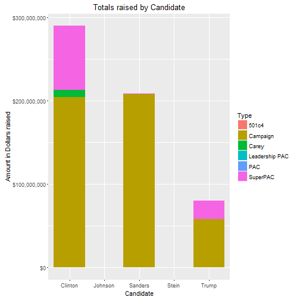

## US elections 2016 campaign analysis
* Analysis of open secrets data US 2016 campaign Finance data from (http://www.opensecrets.org/pres16/also-rans.php)
* Peter Brennan, 12th June 2016
* Analysis done using Shiny interactive app
* 

---

## Analysis of US campaign Data Overview

* Analysis of Opensecrets US 2016 elections Campaign Data
* Data scraped using rvest from http://www.opensecrets.org/pres16/also-rans.php
* Data analyzed using dplyr and ggplot
* Shiny app created and hosted to show differences in funding to both candidates and party's
* https://brennap3.shinyapps.io/CampaignFinanceApp/

---

## What did we learn

* Republicans raise more through PAC's
* Democrats raise more through campaign funding
* Establsihment candidates raise more through PAC's
* Anti establishment candidates in both parties raise little in PAC funding or none in the case of Sanders.

---

## Lets look at the results

